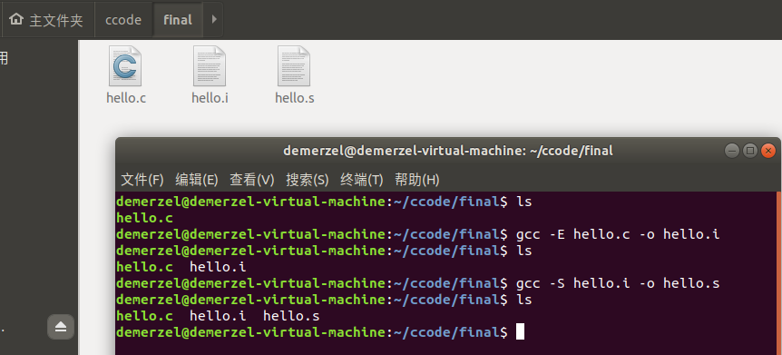
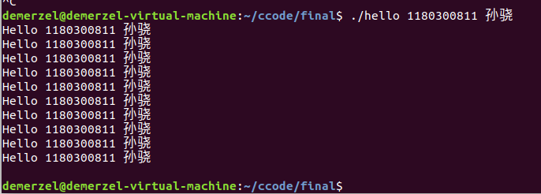

**计算机系统**

**大作业**

题 目 *程序人生-Hello’s P2P*

专 业 *计算机系*

学　　 号 *1180300811*

班　　 级 *1803008*

学 生 *孙骁 　　　*

指 导 教 师 *吴锐 　　*

**计算机科学与技术学院**

**2019年12月**

**摘 要**

本文通过分析hello程序从C文件如何转变为可执行文件的全过程，包括预处理、编译、汇编、链接阶段，每一步如何对上一步形成的文件进行操作，形成新文件的过程。hello进程在shell执行的过程，存储管理的过程，I/O处理的过程。以这些过程的分析为例，阐明整个程序的生命周期。

**关键词：**从程序到进程；编译；汇编  

**目 录**

[第1章 概述 - 5 -](#第1章-概述)

>   [1.1 Hello简介 - 5 -](#hello简介)

>   [1.2 环境与工具 - 5 -](#环境与工具)

>   [1.2.1 硬件环境 - 5 -](#硬件环境)

>   [1.2.2 软件环境 - 5 -](#软件环境)

>   [1.2.3 开发与调试工具 - 5 -](#开发与调试工具)

>   [1.3 中间结果 - 6 -](#中间结果)

>   [1.4 本章小结 - 6 -](#本章小结)

[第2章 预处理 - 7 -](#第2章-预处理)

>   [2.1 预处理的概念与作用 - 7 -](#预处理的概念与作用)

>   [2.1.1 预处理的概念 - 7 -](#预处理的概念)

>   [2.1.2 预处理的作用 - 7 -](#预处理的作用)

>   [2.2在Ubuntu下预处理的命令 - 7 -](#在ubuntu下预处理的命令)

>   [2.3 Hello的预处理结果解析 - 7 -](#hello的预处理结果解析)

>   [2.4 本章小结 - 8 -](#本章小结-1)

[第3章 编译 - 9 -](#第3章-编译)

>   [3.1 编译的概念与作用 - 9 -](#编译的概念与作用)

>   [3.1.1 编译的概念 - 9 -](#编译的概念)

>   [3.1.2 编译的作用 - 9 -](#编译的作用)

>   [3.2 在Ubuntu下编译的命令 - 9 -](#在ubuntu下编译的命令)

>   [3.3 Hello的编译结果解析 - 9 -](#hello的编译结果解析)

>   [3.3.1 汇编指令 - 10 -](#汇编指令)

>   [3.3.2 数据 - 10 -](#数据)

>   [3.3.3 赋值 - 12 -](#赋值)

>   [3.3.4 类型转换 - 12 -](#类型转换)

>   [3.3.5 算数操作 - 13 -](#算数操作)

>   [3.3.6 关系操作 - 13 -](#关系操作)

>   [3.3.7 控制转移 - 14 -](#控制转移)

>   [3.3.8 数组操作 - 15 -](#数组操作)

>   [3.3.9 函数操作 - 15 -](#函数操作)

>   [3.4 本章小结 - 16 -](#本章小结-2)

[第4章 汇编 - 17 -](#第4章-汇编)

>   [4.1 汇编的概念与作用 - 17 -](#汇编的概念与作用)

>   [4.1.1 汇编的概念 - 17 -](#汇编的概念)

>   [4.1.2 汇编的作用 - 17 -](#汇编的作用)

>   [4.2 在Ubuntu下汇编的命令 - 17 -](#在ubuntu下汇编的命令)

>   [4.3 可重定位目标elf格式 - 18 -](#可重定位目标elf格式)

>   [4.3.1 ELF头 - 18 -](#elf头)

>   [4.3.2 节头部表 - 19 -](#节头部表)

>   [4.3.3 重定位信息 - 20 -](#重定位信息)

>   [4.3.4 符号表 - 20 -](#符号表)

>   [4.4 Hello.o的结果解析 - 21 -](#hello.o的结果解析)

>   [4.5 本章小结 - 22 -](#本章小结-3)

[第5章 链接 - 23 -](#第5章-链接)

>   [5.1 链接的概念与作用 - 23 -](#链接的概念与作用)

>   [5.1.1 链接的概念 - 23 -](#链接的概念)

>   [5.1.2 链接的作用 - 23 -](#链接的作用)

>   [5.2 在Ubuntu下链接的命令 - 23 -](#在ubuntu下链接的命令)

>   [5.3 可执行目标文件hello的格式 - 24 -](#可执行目标文件hello的格式)

>   [5.4 hello的虚拟地址空间 - 26 -](#hello的虚拟地址空间)

>   [5.5 链接的重定位过程分析 - 26 -](#链接的重定位过程分析)

>   [5.5.1. 链接过程 - 28 -](#链接过程)

>   [5.5.2. 重定位过程 - 28 -](#重定位过程)

>   [5.6 hello的执行流程 - 29 -](#hello的执行流程)

>   [5.7 Hello的动态链接分析 - 29 -](#hello的动态链接分析)

>   [5.8 本章小结 - 30 -](#本章小结-4)

[第6章 hello进程管理 - 31 -](#第6章-hello进程管理)

>   [6.1 进程的概念与作用 - 31 -](#进程的概念与作用)

>   [6.1.1. 进程的概念 - 31 -](#进程的概念)

>   [6.1.2. 进程的作用 - 31 -](#进程的作用)

>   [6.2 简述壳Shell-bash的作用与处理流程 - 31
>   -](#简述壳shell-bash的作用与处理流程)

>   [6.5.1. Shell-bash的作用 - 31 -](#shell-bash的作用)

>   [6.5.2. Shell的处理流程 - 31 -](#shell的处理流程)

>   [6.3 Hello的fork进程创建过程 - 32 -](#hello的fork进程创建过程)

>   [6.4 Hello的execve过程 - 32 -](#hello的execve过程)

>   [6.5 Hello的进程执行 - 34 -](#hello的进程执行)

>   [6.5.1. 上下文信息 - 34 -](#上下文信息)

>   [6.5.2. 进程时间片 - 34 -](#进程时间片)

>   [6.5.3. 用户模式与内核模式 - 34 -](#用户模式与内核模式)

>   [6.6 hello的异常与信号处理 - 35 -](#hello的异常与信号处理)

>   [6.7本章小结 - 37 -](#本章小结-5)

[第7章 hello的存储管理 - 38 -](#第7章-hello的存储管理)

>   [7.1 hello的存储器地址空间 - 38 -](#hello的存储器地址空间)

>   [7.1.1. 逻辑地址 - 38 -](#逻辑地址)

>   [7.1.2. 线性地址 - 38 -](#线性地址)

>   [7.1.3. 虚拟地址 - 38 -](#虚拟地址)

>   [7.1.4. 物理地址 - 38 -](#物理地址)

>   [7.2 Intel逻辑地址到线性地址的变换-段式管理 - 38
>   -](#intel逻辑地址到线性地址的变换-段式管理)

>   [7.3 Hello的线性地址到物理地址的变换-页式管理 - 40
>   -](#hello的线性地址到物理地址的变换-页式管理)

>   [7.4 TLB与四级页表支持下的VA到PA的变换 - 41
>   -](#tlb与四级页表支持下的va到pa的变换)

>   [7.5 三级Cache支持下的物理内存访问 - 42 -](#三级cache支持下的物理内存访问)

>   [7.6 hello进程fork时的内存映射 - 43 -](#hello进程fork时的内存映射)

>   [7.7 hello进程execve时的内存映射 - 43 -](#hello进程execve时的内存映射)

>   [7.7.1. 删除已存在的用户区域 - 44 -](#删除已存在的用户区域)

>   [7.7.2. 映射私有区域 - 44 -](#映射私有区域)

>   [7.7.3. 映射共享区域 - 44 -](#映射共享区域)

>   [7.7.4. 设置程序计数器（PC） - 44 -](#设置程序计数器pc)

>   [7.8 缺页故障与缺页中断处理 - 45 -](#缺页故障与缺页中断处理)

>   [7.8.1. 缺页故障 - 45 -](#缺页故障)

>   [7.8.2. 缺页中断处理 - 45 -](#缺页中断处理)

>   [7.9动态存储分配管理 - 45 -](#动态存储分配管理)

>   [7.9.1. 动态内存管理基本方法 - 45 -](#动态内存管理基本方法)

>   [7.9.2. 动态内存管理策略 - 46 -](#动态内存管理策略)

>   [7.10本章小结 - 47 -](#本章小结-6)

[第8章 hello的IO管理 - 48 -](#第8章-hello的io管理)

>   [8.1 Linux的IO设备管理方法 - 48 -](#linux的io设备管理方法)

>   [8.2 简述Unix IO接口及其函数 - 48 -](#简述unix-io接口及其函数)

>   [8.2.1. Unix I/O接口统一操作 - 48 -](#unix-io接口统一操作)

>   [8.2.2. Unix I/O函数 - 48 -](#unix-io函数)

>   [8.3 printf的实现分析 - 49 -](#printf的实现分析)

>   [8.4 getchar的实现分析 - 51 -](#getchar的实现分析)

>   [8.5本章小结 - 52 -](#本章小结-7)

[结论 - 53 -](#结论)

[附件 - 54 -](#附件)

[参考文献 - 55 -](#参考文献)

 第1章 概述
==============

1.1 Hello简介
-------------

1.  首先在编辑器中编辑hello代码，得到hello程序。

2.  P2P过程：即From program to process，从程序到进程。hello程序编写后，通过：

    1.  预处理，预处理器(Preprocessor)处理以\#开始的预编译指令，如宏定义(\#define)、头文件引用(\#include)、条件编译(\#ifdef)等；

    2.  编译，使用编译器(Compiler)将C语言，翻译汇编代码；

    3.  汇编，使用汇编器（Assembler）将汇编代码翻译成二进制机器语言；

    4.  链接，使用链接器（Linker）将汇编器生成的目标文件外加库链接为一个可执行文件。

3.  020过程：

>   shell首先fork一个子进程，然后通过execve加载并执行hello，映射虚拟内存，进入程序入口后将程序载入物理内存，进入
>   main函数执行目标代码，CPU为运行的hello分配时间片执行逻辑控制流。当程序运行结束后，shell父进程负责回收hello进程，内核删除相关数据结构。即，从0开始，以0结束，为020。

1.2 环境与工具
--------------

### 硬件环境

>   Intel Core i7-8550U X64 CPU; 1.80GHz; 16G RAM; 128G SSD + 1T HDD;

### 软件环境

>   Windows 10 64位; VMware 15 pro; Ubuntu-18.04.3 LTS;

### 开发与调试工具

>   vim/gedit+gcc; gdb; edb; objdump; readelf; Visual Studio Code; wxHexEditor

 1.3 中间结果
----------------

| 文件名称        | 文件说明                      |
|-----------------|-------------------------------|
| hello.c         | hello源文件                   |
| hello.i         | 预处理后文本文件              |
| hello.s         | 编译得到的汇编文件            |
| hello.o         | 汇编后的可重定位目标文件      |
| hello           | 链接后可执行文件              |
| hello.objdump   | hello可执行文件反汇编代码     |
| hello.elf       | hello的elf文件                |
| helloo.objdump  | hello.o（链接前）的反汇编文件 |
| hello_o_elf.txt | hello.o的ELF格式              |

1.4 本章小结
------------

>   本章对hello进行了简单的介绍，分析了其P2P和020的过程，列出了本次任务的硬件、软件环境和调试工具，并且列举了任务过程中出现的中间产物及其作用。

 第2章 预处理
================

2.1 预处理的概念与作用
----------------------

>   预处理是计算机对一个程序处理的第一步，直接对.c文件进行初步处理成一个.i文件，之后计算机会对.i文件进行接下来的处理。

### 预处理的概念

>   计算机用预处理器（Preprocessor）来执行预处理操作，操作的对象为原始代码中以字符\#开头的命令，包括\#include的头文件、\#define的宏定义，\#if、\#ifdef、\#endif等条件编译。

### 预处理的作用

>   预处理的过程中，对于引用一些封装的库或者代码的这些命令来说，预处理器会读取头文件中用到的库的代码，将这段代码直接插入到程序文件中；对于宏定义来说，会完成对宏定义的替换；注释会直接删除掉。最后将处理过后的新的文本保存在hello.i中。

>         
>   预处理阶段的作用是让编译器在随后对文本进行编译的过程中，更加方便，因为访问库函数这类操作在预处理阶段已经完成，减少了编译器的工作。

2.2在Ubuntu下预处理的命令
-------------------------

命令 gcc -E hello.c -o hello.i

输入后如图2-1所示：

![BFU%Q[R\@\`\`TGKYS1]\$]7{\`K](media/e3c0036a850d77ab236259cd9650030c.png)

图2-1 预处理命令执行结果

2.3 Hello的预处理结果解析
-------------------------

>   hello.c中就包含了三条会被预处理的语句，如下图2-2中所示的代码，处理后在hello.i中可以看到三处库文件调用已被解析，如图2-3,
>   2-4, 2-5所示；预处理阶段会将程序中的注释删除掉。

>   图2-2 hello.c中头文件以及注释信息

>   图2-3 hello.i中对于\#include\<stdio.h\>的处理

>   图2-4 hello.i中对于\#include\<unistd.h\>的处理

>   图2-5 hello.i中对于\#include\<stdlib.h\>的处理

2.4 本章小结
------------

>   预处理是计算机对程序进行操作的第一个步骤，在这个过程中预处理器（preprocessor）会对hello.c文件进行初步的解释，对头文件、宏定义和注释进行操作，将程序中涉及到的库中的代码补充到程序中，将注释这个对于执行没有用的部分删除，最后将初步处理完成的文本保存在hello.i中，方便以后的内核器件直接使用。

 第3章 编译
==============

3.1 编译的概念与作用
--------------------

### 编译的概念

>   编译阶段是编译器（Compiler）对hello.i文件进行处理的过程。此阶段编译器会完成对代码的语法和语义的分析，生成汇编代码，并将这个代码保存在hello.s文件中。

### 编译的作用

1.  词法分析：

>   对由字符组成的单词进行处理，从左至右逐个字符地对源程序进行扫描，产生单个的单词符号，把作为字符串的源程序改造成为单词符号串的中间程序。

1.  语法分析：

>   将词法分析得到的标记流（token）生成一棵语法生成树，判断是否合法。

1.  目标代码生成：

>   将语法生成树转换为依赖于目标机器的汇编代码。

3.2 在Ubuntu下编译的命令
------------------------

命令 gcc -S hello.i -o hello.s

输入后如图3-1所示：

图3-1 编译命令执行结果

3.3 Hello的编译结果解析
-----------------------

### 汇编指令

| 指令             | 含义                                       |
|------------------|--------------------------------------------|
| .file            | C文件声明                                  |
| .text            | 代码段                                     |
| .globl           | 声明全局变量                               |
| .data            | 已初始化的全局和静态C变量                  |
| .align 4         | 声明对指令或者数据的存放地址进行对齐的方式 |
| .type            | 指明函数类型或对象类型                     |
| .size            | 声明变量大小                               |
| .long .string    | 声明long型、string型数据                   |
| .section .rodata | 只读数据段                                 |

>   TIM图片20191222103144

图3-2 hello.s头部段

### 数据

>   hello.c中使用地数据类型包括整数、数组、字符串。

1.  **整数**

2.  int sleepsecs=2.5

>   sleepsecs在源程序中被声明为全局变量，且已经被赋值，编译器处理时在.data节声明该变量，.data节存放已经初始化的全局和静态C变量。在图3-3中，编译器首先将sleepsecs在.text代码段中声明为全局变量，其次在.data段中，设置对齐方式为4、设置类型为对象、设置大小为4字节、设置为long类型其值为2（long类型在32位下与int类型相同为4字节）。

>   TIM图片20191222103144

图3-3 sleepsecs变量信息

1.  int argc

>   argc作为第一个参数传入，图3-4结合汇编代码分析argc保存位置。

>   9[BQP\~A2___PKGF\@)\$LUL\@7

图3-4 argc保存位置

1.  int i

>   编译器将局部变量存储在寄存器或者栈空间中，在hello.s中编译器将i存储在%rbp-4，即%rsp-4中，图3-5中可以看出i占据了栈中的4位，符合int类型。

>   \`\$ENZF6I\`SR\$\$KJRI7B\$GXO

图3-5 i保存位置

1.  **数组**

>   char \*argv[]

>   argv单个元素char\*大小为8位，argv指针指向已经分配好的、一片存放着字符指针的连续空间，起始地址为argv。图3-6分析了argv传入函数时存储的位置

>   main函数中访问数组元素argv[1],argv[2]时，按照起始地址argv大小8位计算数据地址取数据，在hello.s中，使用两次(%rax)（两次rax分别为argv[1]和argv[2]的地址）取出其值。

>   \`%\$6E\@Q9\$L4J1C\$RJ{%X])S

图3-6 \*argv保存位置

1.  **字符串**

2.  “Usage: Hello 学号 姓名！\\n”

>   第一个printf传入的输出格式化参数，存放在只读数据段.rodata中，可以发现字符串被编码成utf-8格式，一个汉字在utf-8编码中占三个字节，一个\\代表一个字节。如图3-7所示。

>   LFMR6ET2V_WC__{JCX2(6]I

图3-7 Usage: Hello 学号 姓名！\\n保存位置

1.  "Hello %s %s\\n"

>   第二个printf传入的输出格式化参数，存放在只读数据段.rodata中。如图3-8所示。

>   5}OGOHN\`LYXZRW{(RDQ9HHL

图3-8 Hello %s %s\\n保存位置

1.  赋值

2.  int sleepsecs=2.5

>   sleepsecs是全局变量，所以直接在.data节中将sleepsecs声明为值2的long类型数据。如图3-9所示。

>   TIM图片20191222103144

图3-9 sleepsecs赋值信息

1.  int i

>   i是保存在栈中的局部变量，直接用mov语句对i进行赋值，因为i是4B即32b，所以用movl对i进行赋值。如图3-10所示。

>   ]SOL8SR1BMCOXK3LH}_[(\`U

图3-10 i赋值信息

### 类型转换

>   涉及隐式类型转换的是：int sleepsecs=2.5，将浮点数类型的2.5转换为int类型。

>   当在double或float向int进行类型转换的时候，程序改变数值和位模式时会向零舍入。例如1.999将被转换成1，-1.999将被转换成-1。进一步来讲，可能会产生值溢出的情况，与Intel兼容的微处理器指定位模式[10…000]为整数不确定值，一个浮点数到整数的转换，如果不能为该浮点数找到一个合适的整数近似值，就会产生一个整数不确定值。

>   浮点数默认类型为double，所以上述强制转化是double强制转化为int类型。遵从向零舍入的原则，将2.5舍入为2。

### 算数操作

1.  **for循环中i++**

>   自增指令在汇编语言中被解释为被操作数加一，采用add指令，因为i是4B即32b，所以用addl对i进行增加，如图3-11所示。

>   \$\`%)\`6\@6}29]\@VWA7%EKHAW

图3-11 i++指令解释

1.  **leaq计算LC1段地址**

>   for循环内部需要对LC1处字符串进行打印，使用了加载有效地址指令leaq计算LC1的段地址%rip+.LC1并传递给%rdi。如图3-12所示。

>   J{41VP4PP](T(8U1W(O%V1J

图3-12 leaq取LC1段地址

### 关系操作

>   总结进行关系操作的指令如下：

| 指令        | 基于   | 解释                     |
|-------------|--------|--------------------------|
| CMP S1, S2  | S2-S1  | 比较设置条件码           |
| TEST S1, S2 | S1&S2  | 测试设置条件码           |
| SET\*\* D   | D=\*\* | 按照\*\*将条件码设置D    |
| J\*\*       | ——     | 根据\*\*与条件码进行跳转 |

>   程序中涉及的关系运算如下：

1.  **argc!=3**

>   判断argc不等于3，hello.s中使用cmpl \$3,
>   -20(%rbp)，计算argc-3的值，设置条件码，为之后je跳转做准备。如图3-13所示。

>   WZ9ZG\@U4U6ZNA[{)KT5KGE8

图3-13 argc!=3汇编解释

1.  **i\<10**

>   判断i\<10，hello.s中使用cmpl \$9,
>   -4(%rbp)，计算i-9的值，设置条件码，为之后jle跳转做准备。如图3-14所示。

>   SF]WE0C9[SQ7_G[TFCN\@UPM

图3-14 i\<10汇编解释

### 控制转移

>   程序中控制转移共有两处：

1.  **if (argv!=3)**

>   当argv不等于3的时候执行程序段中的代码。如图3.15所示，对于if判断，编译器使用跳转指令实现，首先使用cmpl
>   \$3, -20(%rbp)，设置条件码，使用je判断ZF标志位，如果为0，说明argv-3=0
>   argv==3，则不执行if中的代码直接跳转到.L2，否则顺序执行下一条语句，即执行if中的代码。

>   6}5GN4}DE}6ST8H9TMIIA_4

图3-15 if语句执行

1.  **for(i=0;i\<10;i++)**

>   使用计数变量i循环10次。首先无条件跳转到位于循环体.L4之后的比较代码，使用cmpl进行比较，如果i\<=9，则跳入.L4
>   for循环体执行，否则说明循环结束，顺序执行for之后的逻辑。如图3-16所示。

>   8\~QI29{QYL]\~X]T09N3XF8M

图3-15 for语句执行

### 数组操作

>   c源程序中的数组操作出现在循环体for循环中，每次循环中都要访问argv[1],argv[2]这两个内存。在翻译时，argv[]先是被存在用户栈中，再使用基址加偏移量寻址访问argv[1],argv[2]。

>   argv[1]:
>   数组首地址存放于-32（%rbp），先将其存储到%rax中，再加上偏移量\$16，再将该位置内容放在%rdx中，成为下一个函数的第一个参数。

>   argv[2]:
>   数组首地址存放于-32（%rbp），先将其存储到%rax中，再加上偏移量\$8，再将该位置内容放在%rdi中，成为下一个函数的第二个参数。

>   过程如图3-16所示。

>   TIM图片20191222155222

图3-16 argv[1]与argv[2]具体操作

### 函数操作

>   函数是一种过程，过程提供了一种封装代码的方式，用一组指定的参数和可选的返回值实现某种功能。P中调用函数Q包含以下步骤：

1.  传递控制：

>   进行过程Q的时候，PC必须设置为Q的代码的起始地址，然后在返回时，要把PC设置为P中调用Q后面那条指令的地址。

1.  传递数据：

>   P必须能够向Q提供一个或多个参数，Q能够向P中返回一个值。

1.  分配和释放内存：

>   在开始时，Q可能需要为局部变量分配空间，而在返回前，又必须释放这些空间。

>   hello.c中涉及的函数操作有：

1.  main函数：

2.  传递控制:

>   main函数因为被调用call才能执行（被系统启动函数__libc_start_main调用），call指令将下一条指令的地址压栈，然后跳转到main函数。

1.  传递数据:

>   外部调用过程向main函数传递参数argc和argv，分别使用%edi和%rsi存储，函数正常出口为return
>   0，将%eax设置0返回。

1.  分配和释放内存:

>   使用%rbp记录栈帧的底，函数分配栈帧空间在%rbp之上，程序结束时，调用leave指令，leave相当于

>   mov %rbp,%rsp

>   pop %rbp

>   恢复栈空间为调用之前的状态，然后ret返回，ret相当pop IP。

1.  printf函数：

2.  传递数据：

>   第一次printf将%rdi设置为“Usage: Hello 学号
>   姓名！\\n”字符串的首地址。第二次printf设置%rdi为“Hello %s
>   %s\\n”的首地址，设置%rdx为argv[1]，%rsi为argv[2]。

1.  控制传递：

>   第一次printf因为只有一个字符串参数，所以call puts\@PLT；第二次printf使用call
>   printf\@PLT。

1.  exit函数：

2.  传递数据

>   将%edi设置为1。

1.  控制传递

>   call exit\@PLT。

1.  sleep函数：

2.  传递数据

>   将%edi设置为sleepsecs。

1.  控制传递

>   call sleep\@PLT。

1.  getchar函数：

2.  控制传递

>   call gethcar\@PLT

3.4 本章小结
------------

本章主要介绍了有关编译的概念作用，然后使用gcc -S hello.c -o
hello.s生成了编译后的文件。对于生成的.s文件，分析了C语言的数据与操作在机器之中如何被处理翻译的，为下一步汇编打下了基础。

 第4章 汇编
==============

4.1 汇编的概念与作用
--------------------

### 汇编的概念

>   汇编指的是汇编器（Assembler）将hello.s翻译成机器语言指令，把这些指令打包成可重定位目标文件，并将结果保存在目标文件hello.o中。hello.o文件是一个二进制文件，包含hello程序执行的机器指令。

### 汇编的作用

>   将在hello.s中保存的汇编代码翻译成可以供机器执行的二进制代码。使之在链接后能够被计算机直接执行。

4.2 在Ubuntu下汇编的命令
------------------------

命令 gcc -c hello.s -o hello.o

输入后如图4-1所示：

![54)A1)R]MEJ\`)LZD)7[ZCES](media/ab12b476a58bef36b3a849ecc33497e0.png)

图4-1 编译命令执行结果

使用wxHexEditor打开hello.o，显示如图4-2所示：

图4-2 wxHexEditor打开hello.o

4.3 可重定位目标elf格式
-----------------------

>   使用命令 readelf -a hello.o \>
>   hello_o_elf.txt，读取hello.o文件的ELF格式至hello_o_elf_txt中。

### ELF头

>   ELF头以一个16字节的序列开始，描述了生成该文件的系统的字的大小和字节顺序。ELF头剩下的部分包含帮助链接器语法分析和解释目标文件的信息。其中包括ELF头的大小、目标文件的类型（如可重定位、可执行、共享的）、机器类型（如x86-64）、节头部表的文件偏移，以及节头部表中条目的大小和数量。如图4-3所示。

>   CAJ_R4JVZVQI58GOKN_JCNC

图4-3 hello.o ELF头

### 节头部表

>   节头部表包括节的全部信息，如图4-4所示，各个节的名称及内容如下：

| 节名称          | 包含内容                                                      |
|-----------------|---------------------------------------------------------------|
| .text           | 已编译程序的机器代码                                          |
| .rela.text      | 一个.text节中位置的列表，链接器链接其他文件时，需修改这些内容 |
| .data           | 已初始化的全局和静态C变量                                     |
| .bss            | 未初始化的全局和静态C变量和所有被初始化为0的全局或静态变量    |
| .rodata         | 只读数据段                                                    |
| .comment        | 包含版本控制信息                                              |
| .note.GNU-stack | 包含注释信息，有独立的格式                                    |
| .symtab         | 符号表，存放程序中定义和引用的函数和全局变量信息              |
| .strtab         | 字符串表，包括.symtab和.debug节中的符号表以及节头部中的节名字 |
| .shstrtab       | 包含节区名称                                                  |

>   ]\`NW(JJM20E{ZMEJ7Z3{OXA

图4-4 hello.o 节头部表

### 重定位信息

>   重定位是将EFL文件中的未定义符号关联到有效值的处理过程。在hello.o中，对printf，exit等函数的未定义的引用和全局变量（sleepsecs）替换为该进程的虚拟地址空间中机器代码所在的地址。如图4-5所示。

>   IIC\`N(ITRG(V2FKJB5Q\`_7I

图4-5 hello.o 重定位节

### 符号表

>   符号表（.symtab）是用来存放程序中定义和引用的函数和全局变量的信息。重定位需要引用的符号都在其中声明。如图4-6所示。

>   8(E]]%}\$TO}OZNZWP5LK](1

图4-5 hello.o 符号表（.symtab）

 4.4 Hello.o的结果解析
-------------------------

>   使用 objdump -d -r hello.o \> helloo.objdump获得反汇编代码。

>   对比hello.s中main函数与反汇编后main函数如图4-6所示。

图4-6 hello.s中main函数与反汇编后main函数

>   除去显示格式之外两者差别不大，主要差别如下：

1.  **分支转移**

>   反汇编代码跳转指令的操作数使用的不是段名称如.L2，段名称只是在汇编语言中便于编写的助记符，在汇编成机器语言之后使用地是确定的地址。

1.  **函数调用**

>   在.s文件中，函数调用之后直接跟着函数名称，而在反汇编程序中，call的目标地址是当前下一条指令。这是因为hello.c中调用的函数都是共享库中的函数，最终需要通过动态链接器才能确定函数的运行时执行地址，在汇编成为机器语言的时候，对于这些不确定地址的函数调用，将其call指令后的相对地址设置为全0（目标地址正是下一条指令），然后在.rela.text节中为其添加重定位条目，在链接后再进一步确定。     

1.  **全局变量访问**

>   在.s文件中，访问.rodata（printf中的字符串），使用段名称+%rip，在反汇编代码中0+%rip，因为.rodata中数据地址也是在运行时确定，故访问也需要重定位。所以在汇编成为机器语言时，将操作数设置为全0并添加重定位条目。

4.5 本章小结
------------

>   本章介绍了hello从hello.s到hello.o的汇编过程，通过查看hello.o的ELF格式和使用objdump得到反汇编代码与hello.s进行比较的方式，间接了解到从汇编语言映射到机器语言汇编器需要实现的转换。

 第5章 链接
==============

5.1 链接的概念与作用
--------------------

### 链接的概念

>   链接是通过链接器（Linker）将文件中调用的各种函数跟静态库及动态库链接，并将它们打包合并形成目标文件，即可执行文件。可执行文件可以被加载（复制）到内存并执行。

### 链接的作用

>   通过链接可以实现将头文件中引用的函数并入到程序中，解析未定义的符号引用，将目标文件中的占位符替换为符号的地址。完成程序中各目标文件的地址空间的组织，这可能涉及重定位工作。

5.2 在Ubuntu下链接的命令
------------------------

链接命令：

>   ld -o hello -dynamic-linker /lib64/ld-linux-x86-64.so.2
>   /usr/lib/x86_64-linux-gnu/crt1.o /usr/lib/x86_64-linux-gnu/crti.o hello.o
>   /usr/lib/x86_64-linux-gnu/libc.so /usr/lib/x86_64-linux-gnu/crtn.o

输入后结果如图5-1所示：

图5-1 链接之后生成可执行文件

5.3 可执行目标文件hello的格式
-----------------------------

>   使用readelf -a hello \> hello.elf 命令，读取hello的ELF格式至hello.elf中。

>   ELF各节信息中保存了可执行文件hello中的各个节的信息。如图5-2所示。可以看到hello文件中的节的数目比hello.o中多了很多，说明在链接过后有新文件添加进来。

图5-1 链接之后hello的节头表

>   hello的ELF头和hello.o的ELF头大体一致，但是类型从REL (可重定位文件)变为了EXEC
>   (可执行文件)，增加程序头起点，节头和字符串表索引节头的数量变多。

>   图5-2 链接之后hello的ELF头

5.4 hello的虚拟地址空间
-----------------------

使用edb加载hello，查看进程的虚拟地址空间各段信息，如图5-3所示。

图5-3 hello节头表与虚拟地址空间各段

5.5 链接的重定位过程分析
------------------------

执行命令：objdump -d -r hello \> hello.objdump 得到hello的反汇编文件。

图5-4展示hello.o反汇编的结果，图5-5展示hello反汇编结果。

>   图5-4 hello.o反汇编结果

>   图5-5 hello反汇编结果

经比较，hello.o反汇编结果与hello反汇编结果在以下几个方面存在不同：

### 链接过程

1.  函数个数

>   使用ld命令链接时，指定动态链接器为64的/lib64/ld-linux-x86-64.so.2，crt1.o、crti.o、crtn.o中主要定义了程序入口_start、初始化函数_init，_start程序调用hello.c中的main函数，libc.so是动态链接共享库，其中定义了hello.c中用到的printf、sleep、getchar、exit函数和_start中调用的__libc_csu_init，__libc_csu_fini，__libc_start_main。链接器在链接过程中将上述函数加入。

1.  函数调用

>   链接器解析重定条目时需要对R_X86_64_PLT32进行重定位。

>   对于R_X86_64_PLT32，此时动态链接库中的函数已经加入到了PLT中，.text与.plt节相对距离已经确定，链接器计算相对距离，将对动态链接库中函数的调用值改为PLT中相应函数与下条指令的相对地址，指向对应函数。

1.  .rodata段引用

>   链接器解析重定条目时需要对R_X86_64_PC32进行重定位。

>   对于R_X86_64_PC32，需要对.rodata的重定位，即printf中的两个字符串，.rodata与.text节之间的相对距离确定，链接器直接修改call之后的值为目标地址与下一条指令的地址之差，指向相应的字符串。这里以计算第一条字符串相对地址为例说明计算相对地址的算法，图5-6与计算结果相吻合：

>   refptr = s + r.offset = 0x40054a

>   refaddr = ADDR(s)+r.offset

>   =ADDR(main)+r.offset

>   =0x400532+0x18

>   =0x40054a

>   \*refptr = (unsigned) (ADDR(r.symbol) + r.addend-refaddr)

>   =ADDR(str1)+r.addend-refaddr

>   =0x400644+(-0x4)-0x40054a

>   =(unsigned) 0xf6

>   图5-6 第一处call \<puts\>处，第一个字符串地址

### 重定位过程

1.  关联符号定义

>   链接器将代码中的每个符号引用和一个符号定义关联起来。此时，链接器知道输入目标模块中的代码节和数据节的确切大小。

1.  合并输入模块

>   链接器将所有输入到hello中相同类型的节合并为同一类型的新的聚合节。

1.  符号引用

>   链接器修改hello中的代码段和数据段中对每一个符号的引用，使其指向正确的运行地址。

5.6 hello的执行流程
-------------------

使用edb执行hello，查看从加载hello到_start，到call
main,以及程序终止的所有过程。下表列出其调用的程序名称与各个程序地址。

| 程序名称                             | 程序地址        |
|--------------------------------------|-----------------|
| ld-2.27.so!_dl_start                 | 0x7fce:8cc38ea0 |
| ld-2.27.so!_dl_init                  | 0x7fce:8cc47630 |
| hello!_start                         | 0x400500        |
| libc-2.27.so!__libc_start_main       | 0x7fce:8c867ab0 |
| \-libc-2.27.so!__cxa_atexit          | 0x7fce:8c889430 |
| \-libc-2.27.so!__libc_csu_init       | 0x4005c0        |
| hello!_init                          | 0x400488        |
| libc-2.27.so!_setjmp                 | 0x7fce:8c884c10 |
| hello!main                           | 0x400532        |
| hello!puts\@plt                      | 0x4004b0        |
| hello!exit\@plt                      | 0x4004e0        |
| \*hello!printf\@plt                  | ——              |
| \*hello!sleep\@plt                   | ——              |
| \*hello!getchar\@plt                 | ——              |
| ld-2.27.so!_dl_runtime_resolve_xsave | 0x7fce:8cc4e680 |
| \-ld-2.27.so!_dl_fixup               | 0x7fce:8cc46df0 |
| –ld-2.27.so!_dl_lookup_symbol_x      | 0x7fce:8cc420b0 |
| libc-2.27.so!exit                    | 0x7fce:8c889128 |

5.7 Hello的动态链接分析
-----------------------

动态链接库中的函数在程序执行的时候才会确定地址，所以编译器无法确定其地址，在汇编代码中也无法像静态库的函数那样体现。

hello程序对动态链接库的引用，基于数据段与代码段相对距离不变这一个机理，因此代码段中任何指令和数据段中任何变量之间的距离都是一个运行时常量。

动态链接器使用过程链接表PLT+全局偏移量表GOT实现函数的动态链接，GOT中存放函数目标地址，PLT使用GOT中地址跳转到目标函数。如果一个目标模块调用定义在共享库中的任何函数，那么就有自己的GOT和PLT。

PLT是一个数组，其中每个条目是16字节代码。每个库函数都有自己的PLT条目，PLT[0]是一个特殊的条目，跳转到动态链接器中。从PLT[2]开始的条目调用用户代码调用的函数。

GOT也是一个数组，每个条目是8字节的地址，和PLT联合使用时，GOT[2]是动态链接在ld-linux.so模块的入口点，其余条目对应于被调用的函数，在运行时被解析。每个条目都有匹配的PLT条目。

如图5-7、5-8所示，global_offset表在链接前后的变化。

图5-7 do_init之前

图5-7 do_init之后

5.8 本章小结
------------

>   本章分析了链接过程中对程序的处理。Linux系统使用可执行可链接格式，即ELF，具有.text，.rodata等节，并且通过特定的结构组织。

>   经过链接，ELF可重定位的目标文件变成可执行的目标文件，链接器会将静态库代码写入程序中，以及调用动态库等相关信息，将地址进行重定位，从而保证寻址的正确进行。静态库直接写入代码即可，而动态链接过程相对复杂一些，涉及共享库的寻址。

>   链接后，程序便能够在作为进程通过虚拟内存机制直接运行。

 第6章 hello进程管理
=======================

6.1 进程的概念与作用
--------------------

### 进程的概念

>   进程是一个执行中的程序的实例，每一个进程都有它自己的地址空间，包括代码段、数据段、和堆栈区。代码段存储CPU执行的代码，数据段存储变量和进程执行期间使用的动态分配的内存，堆栈区存储活动过程调用的指令和本地变量。

1.  进程的作用

    1.  每次用户向shell输入一个可执行目标文件的名字运行时，shell就会创建一个新的进程，然后在这个进程的上下文中运行这个可执行目标文件。应用程序也能够创建新进程，并且在新进程的上下文中运行它们自己的代码或其他应用程序。

    2.  提供给应用进程两个关键抽象：

2.  一个独立的逻辑控制流，好像程序可以独占使用处理器。

3.  一个私有的地址空间，好像程序独占整个内存系统。

6.2 简述壳Shell-bash的作用与处理流程
------------------------------------

### Shell-bash的作用

>   shell是一个命令解释器，它解释由用户输入的命令并且把它们送到内核。不仅如此，shell有自己的编程语言用于对命令的编辑，它允许用户编写由shell命令组成的程序。

### Shell的处理流程

>   shell首先检查命令是否是内部命令，若不是再检查是否是一个应用程序（可以是Linux本身的实用程序，如ls和rm，也可以是购买的商业程序，或者是自由软件）。然后shell在可执行程序的目录列表里寻找这些应用程序。如果键入的命令不是一个内部命令并且在列表里没有找到这个可执行文件，将会显示一条错误信息。如果能够成功找到命令，该内部命令或应用程序将被分解为系统调用并传给Linux内核。

6.3 Hello的fork进程创建过程
---------------------------

>   在终端中输入./hello 1180300811
>   sunxiao，shell判断它不是内置命令，于是会加载并运行当前目录下的可执行文件hello。

>   此时shell通过fork创建一个新的子进程。新创建的子进程几乎但不完全与父进程相同。子进程得到与父进程用户级虚拟地址空间相同的（但是独立的）一份副本，包括代码和数据段、堆、共享库和用户栈。子进程还获得与父进程任何打开文件描述符相同的副本，这就意味着当父进程调用fork时，子进程可以读写父进程中打开的任何文件。子进程与父进程最大的区别就是有不同的pid。

>   fork被调用一次，返回两次。在父进程中fork返回子进程的pid，在子进程中fork返回0.父进程与子进程是并发运行的独立进程。

>   图6-1展示了终端中fork hello的过程。

>   图6-1终端中fork hello过程

6.4 Hello的execve过程
---------------------

>   execve函数在新创建的子进程的上下文中加载并运行hello程序。execve函数的功能是加载并运行可执行目标文件filename，且带参数列表argv和环境变量列表envp。只有发生错误时execve才会返回到调用程序。所以，execve调用一次且从不返回。进程的地址空间如图6-2所示。

>   图6-2 进程的地址空间

>   加载并运行hello需要以下几个步骤：

1.  删除已存在的用户区域

>   删除当前进程虚拟地址的用户部分中已存在的区域结构。

1.  映射私有区域

>   为新程序的代码、数据、bss和栈区域创建新的区域结构。所有这些新的区域都是私有的、写时复制的。代码和数据区被映射为hello文件中的.text和.data区。bss区域是请求二进制零的，映射到匿名文件，其大小包含在hello中。栈和堆区域也是请求二进制零的，初始长度为零。

1.  映射共享区域

>   如果hello程序与共享对象链接，那么这些对象都是动态链接到这个程序的，然后再映射到用户虚拟地址中的共享区域。

1.  设置程序计数器

>   设置当前进程上下文中的程序计数器，使之指向代码段的入口点。下一次调度这个进程时，它将从这个入口点开始执行。

6.5 Hello的进程执行
-------------------

>   在6.1进程的作用中已经提到过，当前的CPU中并不是只有hello一个程序在运行，这只是一个假象，实际上有很多进程需要执行。首先先了解几个概念：

### 上下文信息

>   上下文是内核重新启动一个被抢占的进程所需要的状态，它由通用寄存器、浮点寄存器、程序计数器、用户栈、状态寄存器、内核栈和各种内核数据结构等对象的值构成。

### 进程时间片

>   一个进程执行它的控制流的一部分的每一时间段叫做时间片。

### 用户模式与内核模式

>   处理器通常使用一个寄存器提供两种模式的区分，该寄存器描述了进程当前享有的特权，当没有设置模式位时，进程就处于用户模式中，用户模式的进程不允许执行特权指令，也不允许直接引用地址空间中内核区内的代码和数据；设置模式位时，进程处于内核模式，该进程可以执行指令集中的任何命令，并且可以访问系统中的任何内存位置。

>   接下来分析hello程序中的具体执行情况。图6-3中展示了hello的代码中会主动引起中断的printf函数。

>   图6-3 引起程序中断的printf函数

>   这段代码中调用了sleep函数，sleep函数的参数的值为2，所以这个sleep函数的作用就是当运行到这一句的时候，程序会产生一个中断，内核会将这个进程挂起，然后运行其它程序，当内核中的计时器到了2秒的时候，会传一个信号给CPU，这时hello进程重新进入待执行进程队列中等待内核调度。

>   从图6-4中可以比较清晰的看出CPU是如何在程序间进行切换的。假设hello进程在sleep之前一直在顺序执行。在执行到sleep函数的时候，切换到内核模式，将hello进程挂起，然后切换到用户模式执行其它进程。当到了2秒之后，发生一个中断，切换到内核模式，继续运行之前被挂起的进程。最后切换回用户模式，继续运行hello进程。

>   图6-4 hello与其他进程间切换

6.6 hello的异常与信号处理
-------------------------

hello执行过程中会出现的异常：

>   中断：信号SIGTSTP，默认行为是 停止直到下一个SIGCONT

>   终止：信号SIGINT，默认行为是 终止

图6-5展示了程序正常运行的结果。程序执行完后，进程被回收，再按回车键退出程序。

>   图6-5 hello正常运行的结果

图6-6展示了运行时乱按时的结果，乱按的输入并不会影响进程的执行，当按到回车键时，getchar会读入回车符，并且后面的字符串会当作shell的命令行输入。

>   图6-6 hello运行时乱按的结果

图6-7展示了运行时按Ctrl+C。父进程收到SIGINT信号，终止hello进程，并且回收hello进程。

>   图6-7 hello运行时按Ctrl+C的结果

图6-8展示了运行时按Ctrl+Z后运行ps命令。按下Ctrl+Z后，父进程收到SIGTSTP信号，将hello进程挂起，ps命令列出当前系统中的进程（包括僵死进程）。运行jobs命令。jobs命令列出当前shell环境中已启动的任务状态。

>   图6-8 hello运行时按Ctrl+Z的结果

图6-9展示了运行时按下Ctrl+Z后运行pstree命令。pstree命令是以树状图显示进程间的关系。

>   图6-9 hello运行时按Ctrl+Z后执行pstree的结果

图6-10展示了运行时按下Ctrl+Z后运行fg命令将进程调到前台的结果，程序继续执行至回车后正常结束。

>   图6-10挂起 hello后输入fg的结果

6.7本章小结
-----------

>   本章中主要介绍了进程的概念以及进程在计算机中的调用过程。还介绍了shell的作用和处理流程，执行hello时的fork和execve过程。分析了hello的进程执行和异常与信号处理过程。

 第7章 hello的存储管理
=========================

7.1 hello的存储器地址空间
-------------------------

### 逻辑地址

>   逻辑地址是指由程序产生的与段相关的偏移地址部分。逻辑地址由一个段（segment）和偏移量（offset）组成，偏移量指明了从段开始的地方到实际地址之间的距离。即hello.o里相对偏移地址。

### 线性地址

>   线性地址是逻辑地址到物理地址变换之间的中间层。在分段部件中逻辑地址是段中的偏移地址，然后加上基地址就是线性地址。

### 虚拟地址

>   虚拟地址是程序保护模式下，程序访问存储器所使用的逻辑地址称为虚拟地址，与实地址模式下的分段地址类似，虚拟地址也可以写为“段：偏移量”的形式，这里的段是指段选择器。就是hello里面的虚拟内存地址。

### 物理地址

>   CPU通过地址总线的寻址，找到真实的物理内存对应地址。
>   CPU对内存的访问是通过连接着CPU和北桥芯片的前端总线来完成的。在前端总线上传输的内存地址都是物理内存地址。

7.2 Intel逻辑地址到线性地址的变换-段式管理
------------------------------------------

>   一个逻辑地址由两部分组成，段选择符和段内偏移量。

>   段选择符是由一个16位长的字段组成，称为段选择符。其中前13位是一个索引号。TI：0为GDT，1为LDT。Index指出选择描述符表中的哪个条目，RPL请求特权级。如图7-1所示：

>   图7-1 段选择符

>   最初8086处理器的寄存器是16位的，为了能够访问更多的地址空间但不改变寄存器和指令的位宽，所以引入段寄存器，8086共设计了20位宽的地址总线，通过将段寄存器左移4位加上偏移地址得到20位地址，这个地址就是逻辑地址。将内存分为不同的段，段有段寄存器对应，段寄存器有一个栈、一个代码、两个数据寄存器。

>   分段功能在实模式和保护模式下有所不同。

1.  实模式

>   即不设防，说逻辑地址=线性地址=实际的物理地址。段寄存器存放真实段基址，同时给出32位地址偏移量，则可以访问真实物理内存。

1.  保护模式

>   线性地址还需要经过分页机制才能够得到物理地址，线性地址也需要逻辑地址通过段机制来得到。段寄存器无法放下32位段基址，所以它们被称作选择符，用于引用段描述符表中的表项来获得描述符。描述符表中的一个条目描述一个段，构造如图7-2所示：

>   图7-2 段描述符

>   对各个部分的功能做简要介绍：

>   Base：基地址，32位线性地址，指向段的开始。

>   Limit：段界限，指出这个段的大小。

>   DPL：描述符的特权级0（最高特权，内核模式）-3（最低特权，用户模式）。

>   所有段描述符被保存在两个表中：全局描述符表（GDT）和局部描述符表（LDT）。电脑中的每一个CPU（或一个处理核心）都含有一个叫做gdtr的寄存器，用于保存GDT的首个字节所在的线性内存地址。为了选出一个段，必须向段寄存器加载以上格式的段选择符。

>   在保护模式下，分段机制就可以描述为：通过解析段寄存器中的段选择符在段描述符表中根据Index选择目标描述符条目Segment
>   Descriptor，从目标描述符中提取出目标段的基地址Base
>   address，最后加上偏移量offset共同构成线性地址Linear Address。

7.3 Hello的线性地址到物理地址的变换-页式管理
--------------------------------------------

>   线性地址（即虚拟地址VA）到物理地址（PA）之间的转换通过分页机制完成。而分页机制是对虚拟地址内存空间进行分页。

>   Linux系统有自己的虚拟内存系统，其虚拟内存组织形式如图7-3所示，Linux将虚拟内存组织成一些段的集合，段之外的虚拟内存不存在因此不需要记录。内核为hello进程维护一个段的任务结构即图中的task_struct，其中条目mm指向一个mm_struct，它描述了虚拟内存的当前状态，pgd指向第一级页表的基地址（结合一个进程一串页表），mmap指向一个vm_area_struct的链表，一个链表条目对应一个段，所以链表相连指出了hello进程虚拟内存中的所有段。

>   图7-3 Linux组织虚拟内存

>   系统将每个段分割为被称为虚拟页（VP）的大小固定的块来作为进行数据传输的单元，在linux下每个虚拟页大小为4KB，类似地，物理内存也被分割为物理页（PP/页帧），虚拟内存系统中MMU负责地址翻译，MMU使用存放在物理内存中的被称为页表的数据结构将虚拟页到物理页的映射，即虚拟地址到物理地址的映射。

>   如图7-4，不考虑TLB与多级页表（在7.4节中包含这两者的综合考虑），虚拟地址分为虚拟页号VPN和虚拟页偏移量VPO，根据位数限制分析可以确定VPN和VPO分别占多少位是多少。通过页表基址寄存器PTBR+VPN在页表中获得条目PTE，一条PTE中包含有效位、权限信息、物理页号，如果有效位是0+NULL则代表没有在虚拟内存空间中分配该内存，如果是有效位0+非NULL，则代表在虚拟内存空间中分配了但是没有被缓存到物理内存中，如果有效位是1则代表该内存已经缓存在了物理内存中，可以得到其物理页号PPN，与虚拟页偏移量共同构成物理地址PA。

>   图7-4 使用页表的地址翻译

7.4 TLB与四级页表支持下的VA到PA的变换
-------------------------------------

>   在Intel Core i7环境下研究VA到PA的地址翻译问题。前提如下：

>   虚拟地址空间48位，物理地址空间52位，页表大小4KB，4级页表。TLB
>   4路16组相联。CR3指向第一级页表的起始位置（上下文一部分）。

>   解析前提条件：由一个页表大小4KB，一个PTE条目8B，共512个条目，使用9位二进制索引，一共4个页表共使用36位二进制索引，所以VPN共36位，因为VA
>   48位，所以VPO 12位；因为TLB共16组，所以TLBI需4位，因为VPN 36位，所以TLBT
>   32位。

>   如图7-5所示
>   ，CPU产生虚拟地址VA，VA传送给MMU，MMU使用前36位VPN作为TLBT（前32位）+TLBI（后4位）向TLB中匹配，如果命中，则得到PPN（40bit）与VPO（12bit）组合成PA（52bit）。

>   如果TLB中没有命中，MMU向页表中查询，CR3确定第一级页表的起始地址，VPN1（9bit）确定在第一级页表中的偏移量，查询出PTE，如果在物理内存中且权限符合，确定第二级页表的起始地址，以此类推，最终在第四级页表中查询到PPN，与VPO组合成PA，并且向TLB中添加条目。

>   如果查询PTE的时候发现不在物理内存中，则引发缺页故障。如果发现权限不够，则引发段错误。

>   图7-5 Core i7四级页表下地址翻译情况

7.5 三级Cache支持下的物理内存访问
---------------------------------

>   由于L1、L2、L3各级Cache的原理相同，只做L1 Cache的分析。L1
>   Cache是8路64组相连高速缓存。块大小64B。因为有64组，所以需要6 bit
>   CI进行组寻址，共有8路，块大小为64B，所以需要6 bit
>   CO表示数据偏移位置，因为VA共52 bit，所以CT共40 bit。

>   在上一步中已经获得了物理地址VA，使用CI进行组索引，每组8路，对8路的块分别匹配CT（前40位）。如果匹配成功且块的valid标志位为1，则命中（hit），根据数据偏移量CO（后六位）取出数据返回。

>   如果没有匹配成功或者匹配成功但是标志位是0，则不命中（miss），向下一级缓存中查询数据（L2
>   Cache-\>L3
>   Cache-\>主存）。查询到数据之后，一种简单的放置策略如下：如果映射到的组内有空闲块，则直接放置，否则组内都是有效块，产生冲突（evict），则采用最近最少使用策略LFU进行替换。如图7-6所示。

>   图7-6 三级Cache支持下的物理内存访问

7.6 hello进程fork时的内存映射
-----------------------------

>   当fork函数被shell调用时，内核为hello创建各种数据结构，并分配给它一个唯一的PID。为了给hello创建虚拟内存，fork创建了当前进程的mm_struct、区域结构和页表的原样副本。它将两个进程中的每个页面都标记位只读，并将两个进程中的每个区域结构都标记为私有的写时复制。

>   当fork在hello中返回时，hello现在的虚拟内存刚好和调用shell的虚拟内存相同。当这两个进程中的任何一个进行写操作时，写时复制机制会创建新页面。因此也就为每个进程保持了私有地址空间的概念。

7.7 hello进程execve时的内存映射
-------------------------------

>   execve函数调用驻留在内核区域的启动加载器代码，在当前进程中加载并运行包含在可执行目标文件hello中的程序，用hello程序有效地替代了当前程序。图7-7描述了加载器映射用户地址空间区域的模型。加载并运行hello需要以下几个步骤：

### 删除已存在的用户区域

>   删除当前进程虚拟地址的用户部分中的已存在的区域结构。

### 映射私有区域

>   为新程序的代码、数据、bss和栈区域创建新的区域结构，所有这些新的区域都是私有的、写时复制的。代码和数据区域被映射为hello文件中的.text和.data区，bss区域是请求二进制零的，映射到匿名文件，其大小包含在hello中，栈和堆地址也是请求二进制零的，初始长度为零。

### 映射共享区域

>   hello程序与共享对象libc.so链接，libc.so是动态链接到这个程序中的，然后再映射到用户虚拟地址空间中的共享区域内。

### 设置程序计数器（PC）

>   设置当前进程上下文的程序计数器，使之指向代码区域的入口点。

>   图7-7 加载器映射用户地址空间区域

7.8 缺页故障与缺页中断处理
--------------------------

### 缺页故障

>   缺页故障是一种常见的故障，当指令引用一个虚拟地址，在MMU中查找页表时发现与该地址相对应的物理地址不在内存中，因此必须从磁盘中取出时就会发生故障。故障处理流程如图7-8所示。

>   图7-8 缺页故障处理流程

### 缺页中断处理

>   缺页处理程序是系统内核中的代码，选择一个牺牲页面，如果这个牺牲页面被修改过，那么就将它交换出去，换入新的页面并更新页表。当缺页处理程序返回时，CPU重新启动引起缺页的指令，这条指令再次发送VA到MMU，这次MMU就能正常翻译VA了。

7.9动态存储分配管理
-------------------

>   printf函数会调用malloc，下面简述动态内存管理的基本方法与策略：

### 动态内存管理基本方法

>   动态内存分配器维护着一个进程的虚拟内存区域，称为堆。分配器将堆视为一组不同大小的块的集合来维护。每个块就是一个连续的虚拟内存片，要么是已分配的，要么是空闲的。已分配的块显式地保留为供应用程序使用。空闲块可用来分配。空闲块保持空闲，直到它显式地被应用所分配。一个已分配的块保持已分配状态，直到它被释放，这种释放要么是应用程序显式执行的，要么是内存分配器自身隐式执行的。

>   分配器分为两种基本风格：显式分配器、隐式分配器。

1.  隐式分配器：要求分配器检测一个已分配块何时不再使用，那么就释放这个块，自动释放未使用的已经分配的块的过程叫做垃圾收集。如图7-9所示。

>   图7-9 隐式分配链表堆块格式

1.  显式分配器：要求应用显式地释放任何已分配的块。如图7-10所示。

>   图7-10 双向空闲链表堆块格式

### 动态内存管理策略

1.  隐式空闲链表

>   头部一共四个字节，前三个字节存储的是块的大小，最后一个字节存储的是当前这个块是空闲块还是已分配的块，0代表空闲块，1代表已分配的块。中间的有效载荷就是用于存放已分配的块中的信息用的。最后的填充部分是为了地址对齐等一些要求用的。

>   隐式链表的结构就是根据地址从小到大进行连接的，如图7-11所示。其中的每一个元素表示的是一个空闲块或者一个分配块，由于空闲块会合并的特性，链表中的元素的连接一定是空闲块的分配块交替连接的。

>   图7-11 隐式空闲链表结构

>   空闲块合并方法：因为有了
>   Footer，所以可以方便的对前面的空闲块进行合并。合并的情况一共分为四种：前空后不空，前不空后空，前后都空，前后都不空。对于四种情况分别进行空闲块合并，只需要通过改变
>   Header 和 Footer 中的值就可以完成这一操作。

1.  显式空闲链表

>   显示结构在空闲块中增加了8个字节，分别保存当前空闲块的前驱空闲块的地址和后继空闲块的地址。显式的结构比隐式结构多维护了一个链表，就是空闲块的链表。这样做的好处就是在malloc的时候，隐式的方法是要遍历所有的块，包括空闲块了分配块。但是显式的结构只需要在空闲块中维护的链表检索就可以了，这样降低了在malloc时候的复杂度。

>   关于空闲块的维护方式一共有两种，一种是后进先出的方式，另一种是按照地址的方式。按照地址维护很好理解，与隐式的结构大致相同。后进先出的方式的思想是，当一个分配块被free之后，将这个块放到链表的最开头，这样在malloc的时候会首先看一下最后被free的块是否符合要求。这样的好处是释放一个块的时候比较高效，直接放在头部就可以。

7.10本章小结
------------

>   本章讨论了存储器地址空间，虚拟地址、物理地址、线性地址、逻辑地址的概念，TLB与四级页表支持下的VA到PA的变换，三级Cache支持下的物理内存访问，hello进程fork时和execve时的内存映射，缺页故障与缺页中断处理和动态存储分配管理。

 第8章 hello的IO管理
=======================

8.1 Linux的IO设备管理方法
-------------------------

设备的模型化：文件

设备管理：Unix I/O接口

所有的I/O设备（例如网络、磁盘和终端）都被模型化为文件，而所有的输入和输出都被当作对相应文件的读和写来执行。这种将设备优雅地映射为文件的方式，允许Linux内核引出一个简单、低级的应用接口，称为Unix
I/O，这使得所有的输入和输出都能以一种统一且一致的方式来执行，这就是Unix
I/O设备管理方法。

8.2 简述Unix IO接口及其函数
---------------------------

### Unix I/O接口统一操作

1.  打开文件

>   应用程序通过要求内核打开相应的文件，想要访问一个I/O设备时，内核返回一个小的非负整数，叫做描述符，它在后续对此文件的所有操作中标识这个文件，内核记录有关这个打开文件的所有信息。

1.  shell创建的每个进程都有三个打开的文件：标准输入，标准输出，标准错误。

2.  改变当前的文件位置

>   对于每个打开的文件，内核保持着一个文件位置k，初始为0，这个k是从文件开头起始的字节偏移量，应用程序能够通过执行seek，显式地将改变当前文件位置。

1.  读写文件

>   读操作是从文件复制n\>0个字节到内存，从当前文件位置k开始，然后将k增加到k+n，给定一个大小为m字节的而文件，当k\>=m时，触发EOF。

>   写操作是从内存中复制n\>0个字节到一个文件，从当前文件位置k开始，然后更新k。

1.  关闭文件

>   内核释放文件打开时创建的数据结构，并将这个描述符恢复到可用的描述符池中。

### Unix I/O函数

1.  int open(char\* filename,int flags,mode_t mode)

>   进程通过调用open函数来打开一个存在的文件或是创建一个新文件的。open函数将filename转换为一个文件描述符，并且返回描述符数字，返回的描述符总是在进程中当前没有打开的最小描述符，flags参数指明了进程打算如何访问这个文件，mode参数指定了新文件的访问权限位。

1.  int close(fd)

>   fd是需要关闭的文件的描述符，close返回操作结果。

1.  ssize_t read(int fd,void \*buf,size_t n)

>   read函数从描述符为fd的当前文件位置赋值最多n个字节到内存位置buf。返回值-1表示一个错误，0表示EOF，否则返回值表示的是实际传送的字节数量。

1.  ssize_t wirte(int fd,const void \*buf,size_t n)

>   write函数从内存位置buf复制至多n个字节到描述符为fd的当前文件位置。

8.3 printf的实现分析
--------------------

>   printf函数功能：接受字符串指针数组fmt，然后将匹配到的参数按照fmt格式输出。图8-1是printf的代码，printf内部调用了两个外部函数，一个是vsprintf，还有一个是write。

>   图8-1 printf代码

>   其中，va_list是一个字符指针，arg表示函数的第二个参数。

>   vsprintf函数代码如图8-2所示：

>   图8-2 vsprintf代码

>   vsprintf的作用是格式化。接受确定输出格式的格式字符串fnt。用格式字符串对个数变化的参数进行格式化，产生格式化输出，并返回要打印的字符串的长度。

>   write函数代码如图8-3所示：

>   图8-3 write代码

>   write函数中，先给寄存器传了几个参数，然后通过系统调用sys_call

>   sys_call函数代码如图8-4所示：

>   图8-4 sys_call代码

>   syscall函数将字符串中的字节从寄存器中通过总线复制到显卡的显存中，显存中存储的是字符的ASCII码。

>   字符显示驱动子程序：从ASCII到字模库到显示vram（存储每一个点的RGB颜色信息）。显示芯片按照刷新频率逐行读取vram，并通过信号线向液晶显示器传输每一个点（RGB分量）。

8.4 getchar的实现分析
---------------------

>   查看getchar函数代码如图8-5所示：

>   图8-4 getchar代码

>   getchar函数调用read函数，将整个缓冲区都读到buf里，并将缓冲区的长度赋值给n。返回时返回buf的第一个元素，除非n\<0。

>   异步异常-键盘中断的处理：键盘中断处理子程序。接受按键扫描码转成ascii码，保存到系统的键盘缓冲区。

>   getchar等调用read系统函数，通过系统调用读取按键ascii码，直到接受到回车键才返回。

8.5本章小结
-----------

>   本章简述了Linux的I/O设备管理机制，Unix
>   I/O接口及函数，并简要分析了printf函数和getchar函数的实现。

结论
====

一个hello程序的“简单”流程如下：

1.  编写，通过编辑器将代码键入hello.c；

2.  预处理，预处理器（Preprocessor）将hello.c调用的所有外部的库展开合并到一个hello.i文件中；

3.  编译，编译器（Compiler）将hello.i编译成为汇编文件hello.s；

4.  汇编，汇编器（Assembler）将hello.s会变成为可重定位目标文件hello.o；

5.  链接，链接器（Linker）将hello.o与可重定位目标文件和动态链接库链接成为可执行目标程序hello；

6.  运行：在shell中输入./hello 1180300811 孙骁

7.  创建子进程：shell进程调用fork函数为hello创建子进程

8.  运行程序：shell调用execve，execve调用启动加载器，加映射虚拟内存，进入hello程序入口后将程序载入物理内存，进入
    main函数执行hello；

9.  执行指令：CPU为其分配时间片，在一个时间片中，hello享有CPU资源，顺序执行相应的控制逻辑流；

10. 访问内存：MMU将程序中使用的虚拟内存地址通过页表映射成物理地址；

11. 动态申请内存：printf会调用malloc向动态内存分配器申请堆中的内存；

12. 信号：如果运行中键入Ctrl + C或Ctrl +
    Z，则调用shell的信号处理函数分别停止、挂起；

13. 结束：shell进程回收hello进程，内核删除为hello进程创建的所有数据结构。

 附件
========

下表列出所有hello分析过程中的中间产物的文件名，和相应的内容。

| 文件名称        | 文件说明                      |
|-----------------|-------------------------------|
| hello.c         | hello源文件                   |
| hello.i         | 预处理后文本文件              |
| hello.s         | 编译得到的汇编文件            |
| hello.o         | 汇编后的可重定位目标文件      |
| hello           | 链接后可执行文件              |
| hello.objdump   | hello可执行文件反汇编代码     |
| hello.elf       | hello的elf文件                |
| helloo.objdump  | hello.o（链接前）的反汇编文件 |
| hello_o_elf.txt | hello.o的ELF格式              |

 参考文献
============

[1] Linux C
常用库函数手册<https://www.linuxfoundation.org/resources/open-source-guides/>

[2] UTF-8编码规则
<https://blog.csdn.net/shenyongjun1209/article/details/51785791>

[3] ELF文件格式解析<https://blog.csdn.net/mergerly/article/details/94585901>.

[4] 内存地址转换与分段<https://blog.csdn.net/drshenlei/article/details/4261909>

[5]
Linux下逻辑地址、线性地址、物理地址详细总结<https://blog.csdn.net/freeelinux/article/details/54136688>

[6] printf 函数实现的深入剖析 <https://www.cnblogs.com/pianist/p/3315801.html>

[7] Linux进程的睡眠和唤醒
<https://blog.csdn.net/shengin/article/details/21530337>

[8] Linux的jobs命令 <https://blog.csdn.net/Quincuntial/article/details/53700161>
